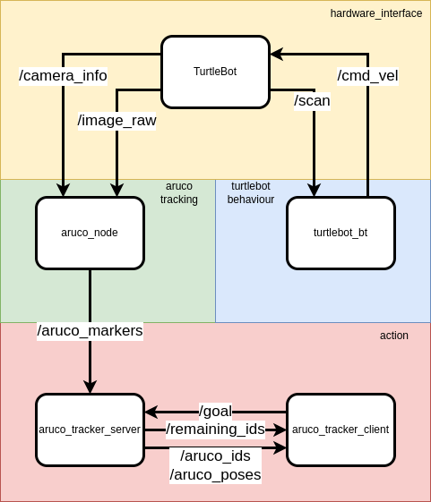

# Homework

## Node diagram



## Opis

*Aruco Marker Tracking* węzeł slużący do detekcji i lokalizacji znacznikow aruco. Wykorzystany [wrapper](https://github.com/JMU-ROBOTICS-VIVA/ros2_aruco)

Subkrybuje:
- /camera_info
- /image_raw
  
Publikuje:
- /aruco_poses
- /aruco_markers

Parametry:
- rozmiar markera
- slownik uzyty do wygenerowania znacznikow


Przeszukiwanie środowiska zostało zrealizowane przy użyciu behaviour tree, opracowanego w poprzednich laboratoriach. Model sprawdza obszar przed sobą; jeśli nie ma przeszkód, porusza się prosto, w przeciwnym razie obraca się. W celu zrealizowania planowanego pokrycia obszaru, można użyć alternatywnej metody, takiej jak[opennav_coverage][https://github.com/open-navigation/opennav_coverage]


Subskrybuje:
- /scan

Publikuje:
- /cmd_vel

Serwer akcji

Request:
```
bool start
---
int32[] aruco_ids
geometry_msgs/Pose[] aruco_poses
---
int32 remaining_ids
```
Serwer akcji nasłuchuje pozycji i ID znaczników Aruco z węzła aruco_node. Otrzymane wiadomości przechowuje w słowniku.

W trakcie działania akcji zwraca ilość pozostałych znaczników do wykrycia, a po zakończeniu wysyła pozycję oraz ID znacznika.
Do poprawy jest uzupełnienie akcji o czas, w jakim ma być zrealizowane zadanie. Jeśli nie zostanie wykonane w określonym czasie, akcja kończy się niepowodzeniem.

## arm05_sim
launch został uzupełniony o dodatkowe węzły oraz o parametry konfiguracyjne
